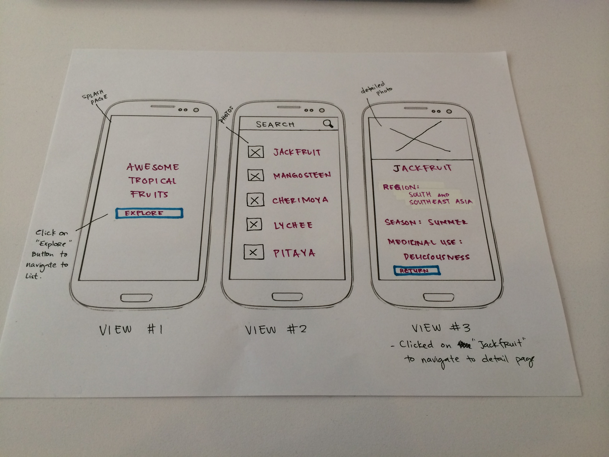
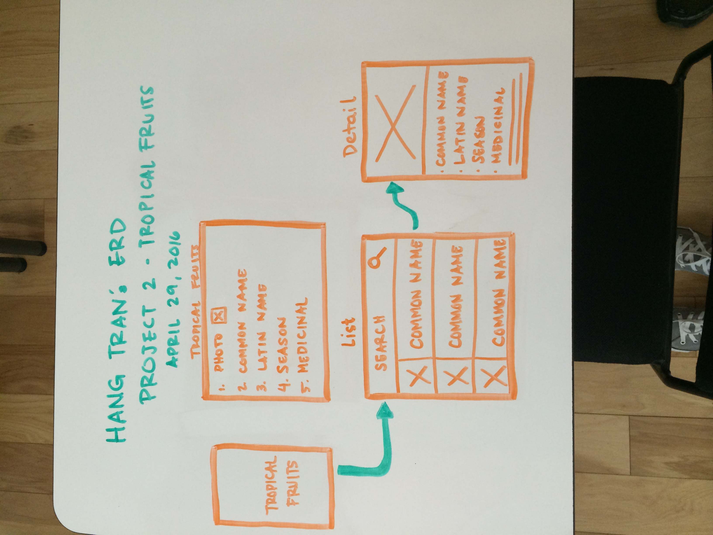

#Project Two
by Hang Tran

This is an Android App of Tropical Fruits. 

The image below is my prototype. 

The image below is an ERD

Manual Test Cases:
1. When the app launches, expect a list of tropical fruits to appear.
2. Click on the search icon, expect the keyboard to populate.
3. Type in any searchable criteria, expect list to update with filtered results. 
4. Click any fruits on the list, expect a new page to appear.
5. Click on any fruits on any list, expect more details about the fruit.
6. When the keyboard is active, expect the list to be scrollable. 
7. Opening the app, expect a branding splash page to appear for a couple seconds. 
8. Close the app, expect for the previous information to persist once app opens again. 
9. When searching, expect for users to search by fruits name.
10. When searching, expect for users to search by fruits original region.
11. When searching, expect for users to search by fruits peak season. 